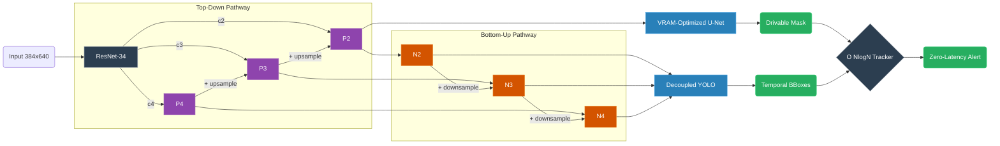

# Panoptic Perception Engine for Autonomous Navigation

A real-time, Multi-Task Learning (MTL) vision system engineered specifically for autonomous vehicle edge-deployment. This engine utilizes a shared ResNet backbone and a Path Aggregation Network (PANet) to simultaneously power object detection (YOLO) and semantic segmentation (U-Net).

Standard autonomous perception pipelines often run decoupled, latency-heavy networks side-by-side, which doubles the memory footprint and degrades inference framerates. This architecture instead processes a single forward pass to understand both discrete obstacles (vehicles, pedestrians) and continuous environments (drivable areas). A deterministic spatial routing algorithm then maps these tensor outputs together to calculate real-time surface collision risks and trigger zero-latency brake alerts.

## Table of Contents

* [Systems Architecture](https://www.google.com/search?q=%23systems-architecture)
* [Handling Multi-Task Loss](https://www.google.com/search?q=%23handling-multi-task-loss)
* [The Collision Tracker](https://www.google.com/search?q=%23the-collision-tracker)
* [Production Training Infrastructure](https://www.google.com/search?q=%23production-training-infrastructure)
* [Performance Metrics & Benchmarking](https://www.google.com/search?q=%23performance-metrics--benchmarking)
* [Installation & Quick Start](https://www.google.com/search?q=%23installation--quick-start)

---

## Systems Architecture

This system was built with strict space-complexity constraints in mind, sacrificing brute-force API reliance for elegant, mathematically sound tensor routing.



* **Shared ResNet-34 Backbone:** A single ResNet-34 architecture acts as the core feature extractor, extracting hierarchical multi-scale feature maps (`c2`, `c3`, `c4`) to eliminate redundant low-level computations.


* **FPN & PANet Feature Fusion:** A Top-Down Feature Pyramid Network (FPN) generates high-resolution spatial maps (`P2`, `P3`, `P4`), which are then passed into a Bottom-Up Path Aggregation Network (PANet) utilizing downsample layers stabilized by `BatchNorm2d` and `SiLU` activations.


* **Decoupled YOLO Head:** The detection head splits into two distinct convolutional branches—one for predicting bounding box coordinates, and another for class probabilities. To prevent the focal loss from exploding on the first epoch, the classification and objectness biases are initialized with a prior probability of 0.01.


* **VRAM-Optimized U-Net:** The segmentation head draws directly from the highest-resolution FPN feature (`P2`) and intentionally omits standard encoder skip-connections. Since the FPN and PANet natively handle top-down and bottom-up feature fusion, re-concatenating those tensors is mathematically redundant and saves a massive amount of peak VRAM.


## Handling Multi-Task Loss

Getting a single network to balance two completely different tasks without one gradient dominating the optimizer requires a highly decoupled loss objective.

* **Balancing the Gradients:** The U-Net segmentation head is optimized using a combination of Focal Loss and Dice Loss to handle the extreme class imbalance between "drivable road" pixels and the "background".


* **Smarter Bounding Boxes:** The YOLO regression branch bypasses standard MSE loss in favor of Complete Intersection over Union (CIoU), which heavily penalizes inaccurate bounding box aspect ratios and offset center coordinates.


* **Smooth Convergence:** The `AdamW` optimizer is paired with a `SequentialLR` scheduler, utilizing a 3-epoch linear warmup phase before smoothly transitioning into a `CosineAnnealingLR` decay.


## The Collision Tracker

Deep learning models output raw tensors; they lack temporal memory. To translate bounding boxes into an actual autonomous driving system, this pipeline relies on a custom spatial collision tracker built with classic computer science algorithms.

* **High-Speed Tracking:** Bypassing heavy tracking libraries, the engine utilizes the Hungarian algorithm (`linear_sum_assignment`) paired with Euclidean centroid distances (`scipy.spatial.distance.cdist`) to track object instances across frames in $O(N \log N)$ time.


* **Object Memory:** The algorithm retains a persistence memory of objects that temporarily disappear behind obstacles or drop in confidence, deregistering them only after they are missing for a specified frame threshold.


* **Semantic Hazard Filtering:** The collision logic maps the bottom-center coordinate of every tracked discrete object to the continuous U-Net drivable road mask. It actively filters out overhead objects—specifically ignoring traffic lights (class 8) and traffic signs (class 9)—so it only flags hazards that are physically touching the vehicle's path.


## Production Training Infrastructure

The training infrastructure is engineered to survive 150-epoch endurance runs on preemptible cloud GPUs.

* **Data Augmentation:** Trained on the challenging BDD100K dataset, the dataloader utilizes custom random `ColorJitter` augmentations to force model robustness against varied lighting, weather, and extreme glare conditions.


* **Atomic Checkpointing:** Model weights and optimizer states are saved to disk using an atomic replacement method (`os.replace`) to completely prevent file corruption if the cloud session gets interrupted mid-save.


* **Mixed Precision Scaling:** The pipeline utilizes PyTorch `autocast` and `GradScaler` to execute the forward pass in `float16`, maximizing GPU batch sizes while preventing VRAM overflow.


---

## Performance Metrics & Benchmarking

*(Note: The following metrics were achieved running the built-in profiling script on an NVIDIA T4 GPU)*

### 1. Hardware Profiling

| Metric | Measured Value | Operational Impact |
| --- | --- | --- |
| **Peak VRAM** | **1.18 GB** | Fits comfortably within edge-device memory limits (e.g., Jetson Orin Nano) without causing OOM crashes. |
| **Inference Latency** | **19.4 ms** | Near-instantaneous tensor processing per frame. |
| **Engine Throughput** | **51.60 FPS** | Comfortably exceeds the 30 FPS threshold required for real-time collision avoidance. |
| **Detection Baseline** | **~20% mAP@0.5** | A stable scratch baseline proving multi-task convergence on the highly challenging 70,000-image BDD100K dataset. |

### 2. Custom Engine vs. Industry APIs

If the goal is simply the highest possible metric score on a leaderboard, calling `model = YOLOv8()` is the easy way out. But in the real world, autonomous vehicles don't have unlimited compute. This system intentionally trades brute-force parameter bloat for massive gains in inference speed and memory efficiency.

| Metric | Custom Panoptic Engine | Industry APIs (YOLOv8 + SMP U-Net) | The Engineering Tradeoff |
| --- | --- | --- | --- |
| **Model Footprint** | **~21 Million** | ~30+ Million | Sharing a single ResNet-34 backbone drastically compresses the total parameter count. |
| **Peak VRAM** | **1.18 GB** | 2.50+ GB | Stripping the U-Net skip-connections prevents massive memory spikes during the forward pass. |
| **Throughput** | **51.60 FPS** | ~15 - 20 FPS | By unifying the architecture, a single forward pass prevents the fatal bottleneck of running two massive APIs sequentially. |

---

## 🛠️ Installation & Quick Start

### 1. Clone & Install Dependencies

```bash
git clone https://github.com/Asmit159/Panoptic-Perception-Engine.git
cd Panoptic-Perception-Engine
pip install torch torchvision numpy opencv-python scipy matplotlib tqdm

```

### 2. Live Inference & Tracking

To pass unlabelled test images through the panoptic engine and the spatial collision tracker:

```python
import torch
from engine import PanopticPerceptionEngine, run_testing_pipeline

device = torch.device('cuda' if torch.cuda.is_available() else 'cpu')

# Initialize engine and load atomic weights
model = PanopticPerceptionEngine().to(device)
model.load_state_dict(torch.load('checkpoints/panoptic_latest.pth')['model_state_dict'])

# Execute evaluation and tracker pipeline
run_testing_pipeline(
    model=model, 
    test_dir='./data/test_images', 
    output_dir='./predictions', 
    device=device,
    conf_threshold=0.40
)

```

---

**Author:** Asmit Mandal
