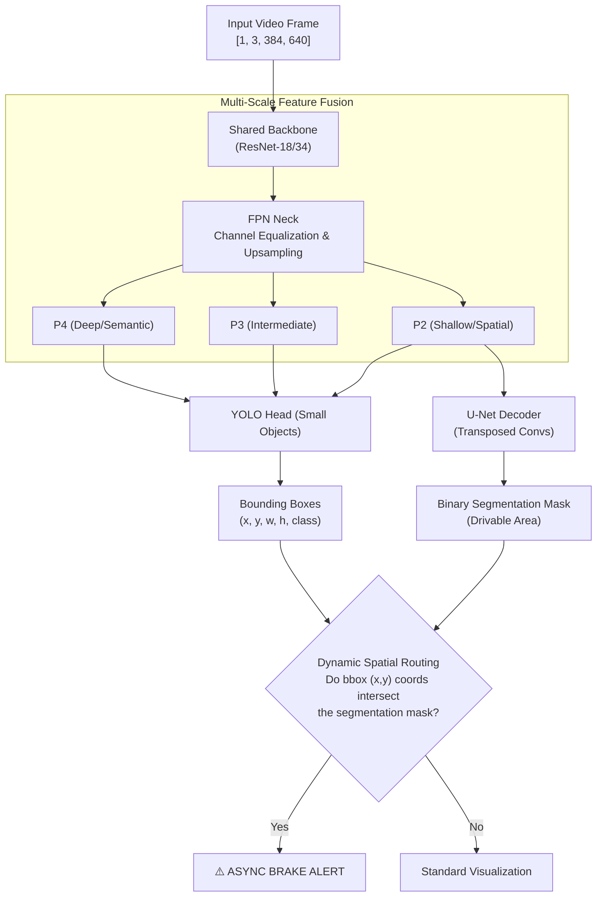

# Panoptic Perception Engine for Autonomous Navigation


A real-time, Multi-Task Learning (MTL) vision system designed for autonomous vehicle edge-deployment. This engine utilizes a shared ResNet backbone and a Feature Pyramid Network (FPN) to simultaneously power object detection (YOLO) and semantic segmentation (U-Net). 

Instead of running decoupled, latency-heavy networks, this architecture processes a single forward pass to understand both discrete obstacles (vehicles, pedestrians) and continuous environments (drivable areas). A deterministic spatial routing algorithm maps these outputs together to calculate real-time collision risks and trigger zero-latency brake alerts.

## Table of Contents
- [Architecture](#architecture)
- [Core Features](#core-features)
- [Target Performance Benchmarks](#target-performance-benchmarks)
- [Installation & Usage](#installation--usage)

---

## Architecture

The system mimics the "HydraNet" paradigm, decoupling feature extraction from task-specific heads to optimize VRAM and maximize FPS on edge hardware.



---

## Core Features

* **Multi-Task Feature Extractor:** A unified PyTorch `nn.Module` replacing decoupled models. The ResNet backbone branches into an FPN neck, balancing gradient flows for simultaneous YOLO bounding box regression and U-Net pixel-dense segmentation.
* **Dynamic Spatial Routing (Collision Logic):** A highly optimized $O(N)$ algorithmic bridge that extracts the bottom-center coordinates of bounding boxes and calculates matrix intersections against the semantic mask to determine physical drivable-area intrusions.
* **Asynchronous Processing Pipeline:** A thread-safe Python multiprocessing architecture that decouples video I/O from GPU tensor inference, ensuring no dropped frames and maximizing VRAM utilization.
* **Custom Joint Loss Function:** Stabilizes backpropagation by mathematically balancing the severe scale variance between massive continuous pixel blocks (the road) and sparse, tiny pixel clusters (distant traffic lights).

---

## Target Performance Benchmarks

*Designed to hit industry baselines (BDD100K equivalents).*

| Metric | Target | Notes |
| --- | --- | --- |
| **Inference Latency** | 30 - 41 FPS | Evaluated on edge-equivalent GPU hardware |
| **Detection (mAP50)** | > 78.0% | Prioritizing high recall for pedestrian classes |
| **Segmentation (mIoU)** | > 91.0% | Drivable area classification via P2 FPN layer |

---

## Installation & Usage

**1. Clone the repository**

```bash
git clone [https://github.com/Asmit159/Panoptic-Perception-Engine.git](https://github.com/Asmit159/Panoptic-Perception-Engine.git)
cd Panoptic-Perception-Engine

```

**2. Install dependencies**

```bash
pip install -r requirements.txt

```

**3. Run the live inference engine**

```bash
python engine.py --source data/dashcam_sample.mp4 --conf_thres 0.45

```

---

**Author:** Asmit Mandal
